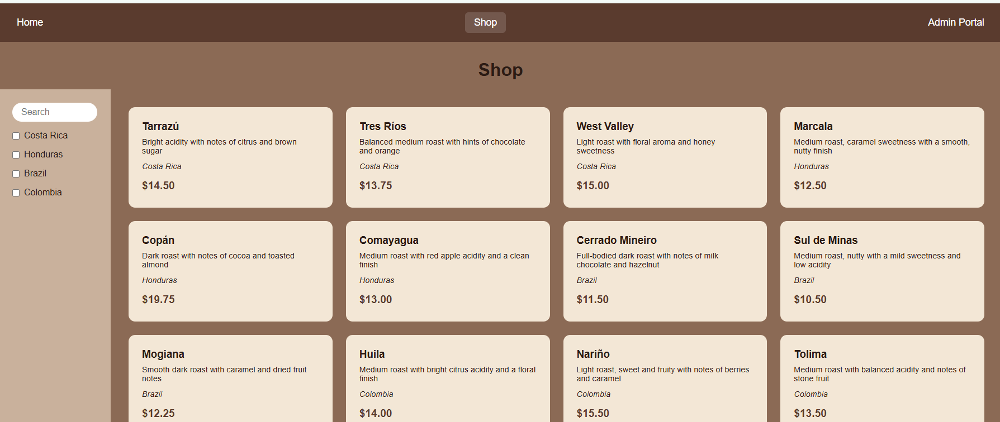

# Coffees-R-Us — Admin Portal

A React-based single-page application built as a personal project showcase, simulating an administrator portal for a coffee e-commerce site. Built with React, React Router, and a simulated backend via json-server.



## Features

- **Home page** — landing page introducing the site
- **Shop page** — browsable grid of all products, with dynamic search and location-based filtering
- **Admin Portal** — form to add new products
- **Product Detail page** — view, edit, and delete individual products
- **Full CRUD** — Create, Read, Update, and Delete products via a simulated REST API (json-server)
- **Client-side routing** — 4 routes with persistent navigation
- **Custom hook** — `useFetch` for reusable data fetching logic
- **Responsive, styled UI** matching the original design mockup

## Tech Stack

- React (Vite)
- React Router
- json-server (simulated backend)
- Vitest + React Testing Library (testing)

## Getting Started

1. Clone the repo and install dependencies:
```bash
   npm install
```

2. Start the simulated backend (in one terminal):
```bash
   npx json-server db.json --port 3001
```

3. Start the development server (in a second terminal):
```bash
   npm run dev
```

4. Open the local URL shown in your terminal (typically `http://localhost:5173`)

## Running Tests

```bash
npm test
```

## Project Structure

```
src/
├── components/   # All React components
├── hooks/        # Custom hooks (useFetch)
├── styles/       # CSS files, one per component
├── tests/        # Vitest + React Testing Library test suites
db.json           # Simulated backend data
```